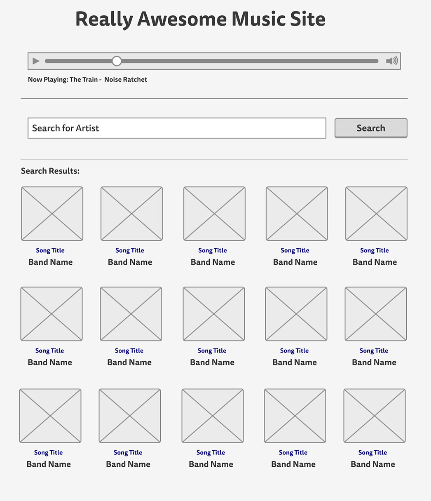

# iTunes Search

## Skills

TODO

## Directions

For this app, we will be using iTunes API to pull data from. 

You'll use this data to pull songs based on a search that your user performs. Here is an idea of what the [end result](https://tiy-learn-content.s3.amazonaws.com/c888498b-musicapp.jpg) should look like, though you can have fun with the design.

Here are the steps you'll need to take in order to complete this project.

1. Build a simple form that has an `<input>` where a user can fill in their a band or artist, like "Kelly Clarkson", and it will return a handful of songs by them or with their name in it.
2. When the user types in a band name and presses the **submit** button, you should then make the search request. You can trap this with an event listener.
3. Once you have the search term, you should send an Ajax request to the specific endpoint and use the results to display a listing of songs related to the search term.
4. Then to add some features, you should set it up so when a user clicks on one of the songs, it should then play in an `<audio>` tag that you've also added to the page (see the mockup).

### Hints & Tips

There will be some new concepts you'll need to work through on this project, so feel free to ask for assistance along the way.

- [API Documents](https://affiliate.itunes.apple.com/resources/documentation/itunes-store-web-service-search-api/)
  - You've likely never worked with a robust API before, so you'll need to take time to read through the documentation before getting started. Everything you'll need to know is in there. 
- Form Submission
  - You should use the `submit` event listener method on your form. This will trap when the button was pressed, thus allowing you to write a handler function.
  - You'll also need to get the current value after the submission has happened.
- Fetching Data
  - You'll need to take the value from above and use that to build out your URL to send to iTunes.
- Playing a Song
  - You'll need to research the `<audio>` tag for this part - [docs here](https://developer.mozilla.org/en-US/docs/Web/HTML/Element/audio)
  - **Hint**: _You'll need to dynamically change the `src` value_

The hardest part will likely be getting the song to play. Since your JavaScript has already run, adding a `click` event listener before you add the content won't work. You need to get creative here, but putting your `click` around the entire results section, and then making sure to get the correct item clicked on. Here is a great [article on Event Delegation](https://davidwalsh.name/event-delegate)

### Mockup & Starter Files

Note, the below wireframe is just an idea of the structure. You can follow it perfectly or do something completely different. As long as the requirements above are there, then you are fine.

### Bonus steps

Add a radio button to switch the search between artist, song title, or album title.
